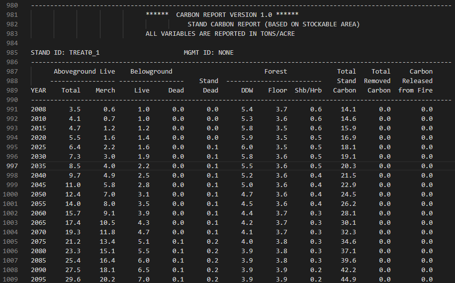
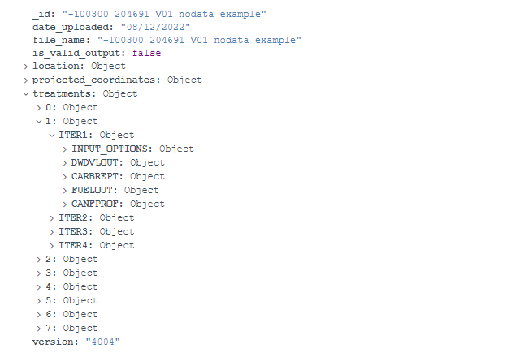
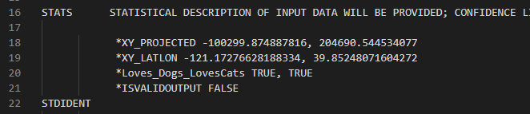
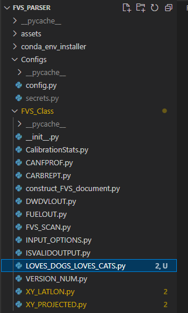
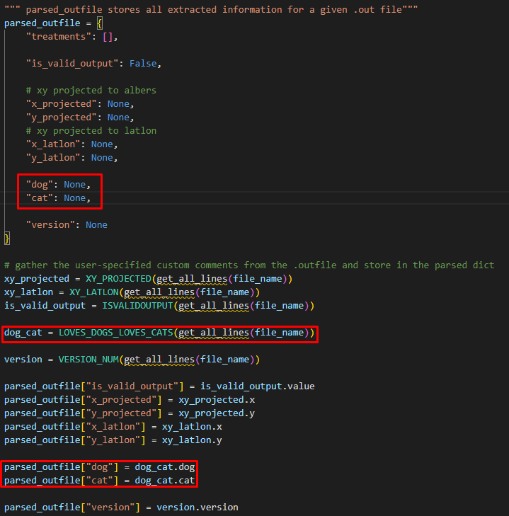
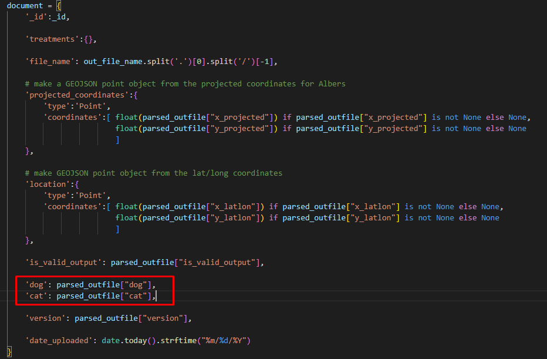

# FVS Parser
___
This repository allows for an easy to use Python API to help parse data from the outputs of the U.S. Forest Service's Forest Vegetation Simulator  ([FVS](https://www.fs.fed.us/fvs/)). 

  

The outputs from FVS come in human-readable tabular data like the image shown above. This lack of structure does not lend itself well to interfacing with data-science applications like Python, R, Excel, MongoDB, etc. This project aims to bridge that gap by extracting the data into a defined JSON object structure that can easily be extended for use in other applications. 

___

## User Features

The parser can extract the following top-level features:
- Calibtation Statistics
- CANFPROF
- CARBREPT
- DWDVLOUT
- FUELOUT

Able to parse out user-specified comment fields within .out file
- *XY_PROJECTED stores the Albers Projected Coordinates for the plot
    - Stores the coordinates in a GEOJSON object for geospatial querying capabilities
- *XY_LATLON stores Latitude/Longitude Coordinates for the plot
    - Stores the coordinates in a GEOJSON object for geospatial querying capabilities
- *ISVALIDOUTPUT stores TRUE/FALSE to help track of keyfile errors against plots that contain zero trees
___

## Developer Features
- Add a `secrets.py` file in the `Configs` folder to store MongoDB information
    - `mongo_client_username = ***`
    - `mongo_client_password = ***`
    - `mongo_client_database = ***`
    - `mongo_client_collection = ***`
    - `mongo_client_name = mongodb://***`
- `utils/` and `scripts/` packages allows for easily contributing new functions without breaking others

___
## Installation
**REQUIREMENTS:** Windows
> Note: This was only tested on outputs of FVS Version 3856; 

FVS Parser requires the following software in order to run
- [Anaconda](https://www.anaconda.com/products/individual) to manage Python packages & environment

Install the conda environment by running `conda_env_installer/installer.bat` 
OR, for a manual installation, create the conda environment from `conda_env_installer/environment.yml` using the conda commands from [here](https://docs.conda.io/projects/conda/en/latest/user-guide/tasks/manage-environments.html#creating-an-environment-from-an-environment-yml-file)
___
## .out File Oranization

Place all .out files from an FVS run in the `outputs/` folder. 
This is where the program expects to find the .out files you want to parse. 

___
## Running your first parse

- Make sure your .out files are in the `outputs/` folder or use the test ones already there. 
- Setup your `secrets.py` to contain custom MongoDB information
- Run `driver.py`; This script will parse all information from the .out files in the `outputs/` folder and upload the scans to your MongoDB. 
___
## MongoDB Architecture & Organization

  

### Document UID conventions
The UID will default to being `<XY_PROJECTED.X>_<XY_PROJECTED.Y>_<FvsVersionNumber>`.

If the user defined comment field `XY_PROJECTED` is not present or does not contain valid values, the UID will instead be the .out filename. 

### Document meta-data

- Each document contains the `.out` filename that was used to generate itself.
- Each document logs the date that it was uploaded to the database.
- Each document logs the FVS version number used to generate itself. 
- Each document contains a collection of Treatments for a given .out file. 
- Each Treatment is a collection of Iterations. 
- Each Iteration is a collection of top-level features (CARBREPT, DWDVLOUT, etc). 
- Each top-level feature is broken down by year. 
- For a given year, you can check the stats of a low-level feature (Total Stand Carbon, Stand Dead, etc).

___
## Development

### Creating custom User-specified comment parsers

Creating new on-demand user-defined comment parsing is necessary should your workflow wish to transfer more information from previous steps into this parser. 

Here are the steps to making a custom comment parser

In this example, we want to make a custom comment to keep track of if the outfile loves dogs or cats or both.

First, lets see what this comment would look like inside the `.out` file.

  

We specify this as a user-defined comment by beginning it with `*Loves_Dogs_Loves_Cats`

Next it is followed by two boolean values with a comma delimiter separating the two values. 

Inside the code, we need to add a LOVES_DOGS_LOVES_CATS class within `FVS_PARSER/FVS_Class/LOVES_DOGS_LOVES_CATS.py`

  

To accomplish this, we will copy/paste another comment parser class (in this case we are copying `XY_PROJECTED.py`) and rename it to `LOVES_DOGS_LOVES_CATS.py`. This will help allow us to refactor already existing code to fit our new custom comment field.

From here, carefully read the comments within the refactored code and make appropriate changes to parse out the two boolean values. Store them in class attribute variables.

Now, we need the FVS parser to actually utilize this class and extract the comment. To do this, open up `FVS_PARSER/driver.py` and follow the lead of the other user-defined custom comments. The picture below is an example of how to do this. Boxed in red is the refactored code to add dog/cat parameters. 

  

Now that this information is stored in our FVS_Class object, it needs to be transfered to a format that MongoDB documents understand (JSON). To do this, open `FVS_PARSER/FVS_CLASS/construct_FVS_document.py`. In the code that constructs the mongo document, add our custom parameters to the JSON object like the above picture. 

  

And thats it! You should see your changes reflected in the document uploaded to mongo!

## Contributing

Want to contribute? Great!

Email [Gunner](https://github.com/GunnerStone) for collaborator access or fork and make your own version!
## License

MIT

